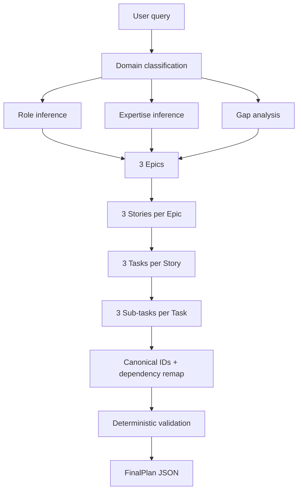

# Local Planner

**Local-first hierarchical planning with Ollama, exact-output consensus, and deterministic validation.**

[](https://github.com/InvBoy01001/local-planner/actions/workflows/ci.yml)
[](https://www.python.org/)
[](LICENSE)

Local Planner turns a fuzzy request into a structured execution plan:

```text
request → domain brief → gaps → epics → stories → tasks → sub-tasks → validation
```

It is designed for people who want to experiment with planning agents **without sending their planning prompts to a hosted LLM API**. The default model backend is a local [Ollama](https://ollama.com/) instance.

> **Project status:** early-stage / alpha. The core API is usable, but plan quality still depends heavily on the chosen local model. Generated plans are suggestions, not instructions that should be executed blindly.

## Why this project exists

A single long LLM prompt can produce plausible plans while silently dropping requirements, duplicating work, inventing dependencies, or truncating nested output. Local Planner explores a different approach: split planning into small model calls, reject malformed responses early, assemble a predictable hierarchy, and run deterministic checks after generation.

The current prototype focuses on five properties:

- **Local-first inference:** Ollama is the only model backend in the default path; no API key is required.
- **Hierarchical decomposition:** every plan expands into 3 epics, 3 stories per epic, 3 tasks per story, and 3 sub-tasks per task.
- **Red-flagging before voting:** malformed JSON, missing keys, and invalid list cardinality are discarded.
- **Exact-output consensus:** valid canonical JSON outputs vote until a candidate reaches the configured lead or the attempt budget ends.
- **Deterministic graph validation:** canonical IDs, dependency remapping, dangling-edge checks, cycle detection, duplicate detection, and basic truncation checks happen in normal Python code.

## Architecture



See [`docs/architecture.md`](docs/architecture.md) for the design boundaries and reliability model.

## Quick start

### 1. Requirements

- Python 3.11+
- Ollama
- enough local RAM/VRAM for the model you choose

Pull the default model:

```bash
ollama pull qwen2.5:7b-instruct
```

### 2. Install Local Planner

```bash
git clone https://github.com/InvBoy01001/local-planner.git
cd local-planner
python -m venv .venv
source .venv/bin/activate
python -m pip install -e .
```

For contributors:

```bash
python -m pip install -e '.[dev]'
```

### 3. Configure

Defaults work with a normal local Ollama install. To override them:

```bash
cp .env.example .env
export OLLAMA_MODEL=qwen2.5:7b-instruct
export OLLAMA_MAX_CONCURRENCY=2
```

The project reads environment variables directly; `.env` is provided as a template and is intentionally not auto-loaded.

### 4. Run

```bash
uvicorn main:app --reload --host 127.0.0.1 --port 8000
```

Open `http://127.0.0.1:8000/docs` for the bundled Swagger UI.

Check health:

```bash
curl http://127.0.0.1:8000/health/live
curl http://127.0.0.1:8000/health/ready
```

Generate a plan:

```bash
curl -X POST http://127.0.0.1:8000/api/v1/plan-query \
  -H 'Content-Type: application/json' \
  -d @examples/request.json
```

## Docker Compose

A Compose file is included for a reproducible local stack:

```bash
docker compose up -d ollama
docker compose exec ollama ollama pull qwen2.5:7b-instruct
docker compose up --build planner
```

The API is then available on `http://127.0.0.1:8000`.

## Output contract

The API returns a `FinalPlan` with request classification, gap analysis, the nested plan, and deterministic warnings:

```json
{
  "user_role": "Backend developer",
  "expertise_level": "Intermediate",
  "original_domain": "Software & technology",
  "area": "Backend web services",
  "sub_domain": "Production FastAPI service",
  "domain_summary": "...",
  "technical_context": "FastAPI, PostgreSQL, Docker Compose",
  "success_criteria": "...",
  "gaps": [],
  "validation_warnings": [],
  "epics": [
    {
      "title": "...",
      "description": "...",
      "stories": [
        {
          "id": "E1-S1",
          "depends_on": [],
          "tasks": [
            {
              "id": "E1-S1-T1",
              "depends_on": [],
              "sub_tasks": []
            }
          ]
        }
      ]
    }
  ]
}
```

IDs returned by the API are assigned by the application rather than trusted from the model. This avoids cross-epic collisions caused by generated acronyms.

## Reliability: what is checked and what is not

Local Planner currently checks structure, not truth. It can detect malformed or suspicious plan graphs, but it cannot prove that a generated technical recommendation is correct.

| Check | Status |
| --- | --- |
| JSON object returned | ✅ |
| Required top-level keys | ✅ |
| Required list cardinality | ✅ |
| Canonical story/task IDs | ✅ |
| Self dependencies | ✅ |
| Dangling dependencies | ✅ |
| Dependency cycles | ✅ |
| Obvious text truncation | ✅ heuristic |
| Semantic correctness | ⚠️ model-dependent |
| Requirement coverage | ⚠️ prompt/model-dependent |
| Factual verification against external docs | ❌ not implemented |

The evaluation roadmap is documented in [`docs/evaluation.md`](docs/evaluation.md).

## Configuration

| Variable | Default | Purpose |
| --- | --- | --- |
| `OLLAMA_HOST` | `http://127.0.0.1:11434` | Ollama server |
| `OLLAMA_MODEL` | `qwen2.5:7b-instruct` | generation model |
| `OLLAMA_MAX_CONCURRENCY` | `2` | maximum simultaneous model calls |
| `OLLAMA_TIMEOUT_SECONDS` | `1000` | backend request timeout |
| `LOG_LEVEL` | `INFO` | Python application log level |

Because the plan expands deeply, one request can require many local model generations. Start with concurrency `1` or `2` on smaller machines.

## Optional plan visualization

A dependency-free HTML mind map is included for inspecting a `FinalPlan` visually. It ships with a small sample and can also load any compatible JSON file from disk.

```bash
python -m http.server 8080
```

Then open `http://127.0.0.1:8080/tools/mindmap.html`.

## Development

```bash
make dev
make lint
make test
make run
```

CI runs Ruff and the unit tests on Python 3.11, 3.12, and 3.13. The unit suite does not require a running Ollama instance.

Repository layout:

```text
.
├── main.py                 # FastAPI surface
├── state_manager.py        # orchestration and plan assembly
├── ollama_client.py        # Ollama transport + consensus/red-flagging
├── prompts.py              # prompt contracts
├── plan_validation.py      # deterministic graph/text validation
├── schemas.py              # public Pydantic models
├── config.py               # environment-driven runtime settings
├── tests/                  # deterministic regression tests
├── docs/                   # architecture, evaluation, research notes
├── examples/               # example API input
└── tools/                  # dependency-free plan visualization
```

## Roadmap

The most useful next contributions are measurable rather than cosmetic:

- public golden evaluation cases across software and non-software planning;
- requirement-coverage and duplication metrics;
- run metadata such as phase latency and model-call counts;
- optional adapters for additional local inference backends;
- optional evidence retrieval for stack-specific factual grounding;
- editor/deduplication pass with regression measurements;
- stable visualization generated directly from `FinalPlan`.

See the issue tracker for work that is actually scheduled. Roadmap items above are directions, not promises.

## Contributing

Contributions are welcome. Please read [`CONTRIBUTING.md`](CONTRIBUTING.md) and [`AGENTS.md`](AGENTS.md) before making larger changes. Bug reports that include a minimal prompt, model version, and reproducible output are especially useful.

Security-sensitive reports should follow [`SECURITY.md`](SECURITY.md).

## Research note

The repository experiments with repeated sampling, red-flagging, and first-to-ahead-by-k voting inspired by long-horizon LLM research. This implementation is a planning experiment, not a claim that model consensus guarantees correctness. Deterministic validation remains deliberately separate from generation. See [`docs/research.md`](docs/research.md) for the exact scope and citation.

## License

MIT — see [`LICENSE`](LICENSE).
